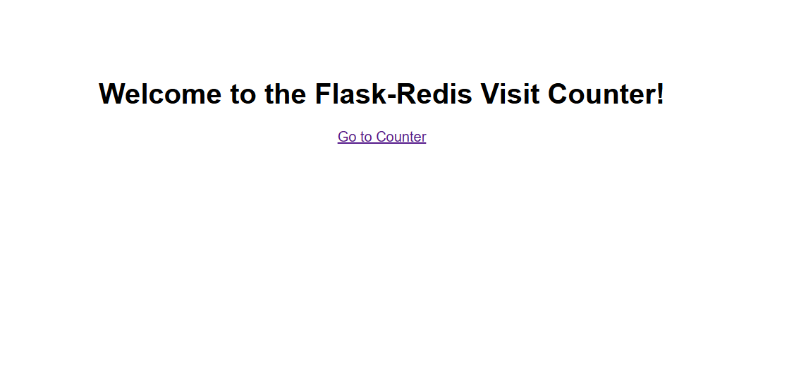
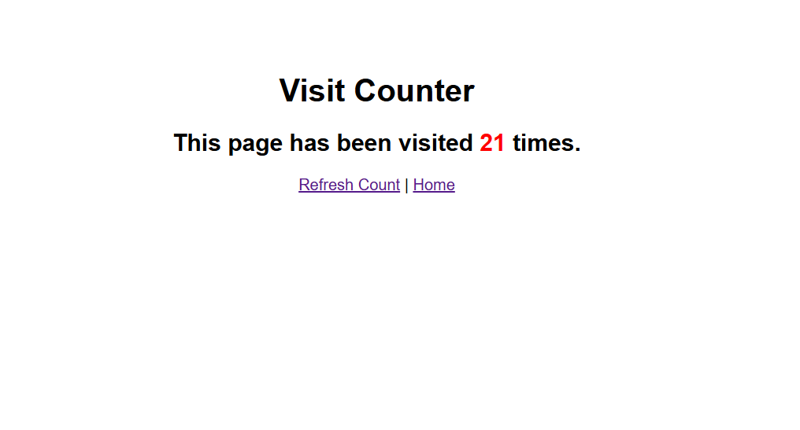
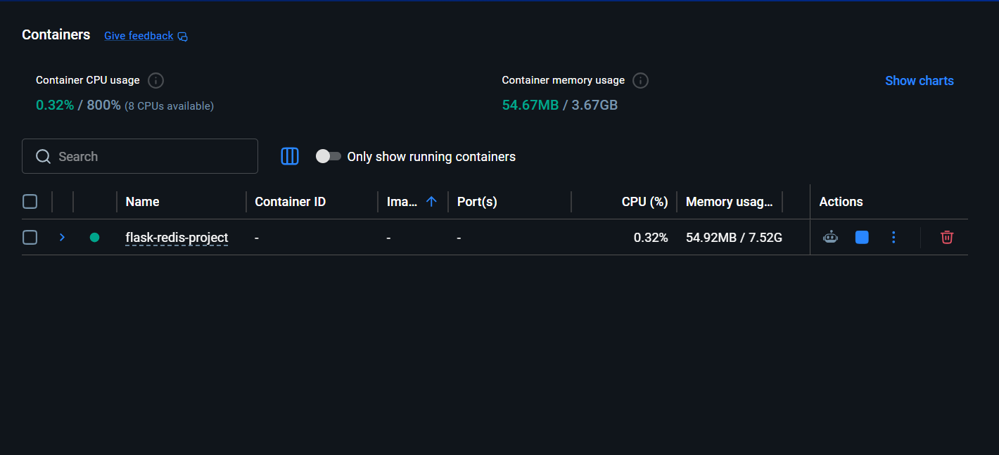

# Flask-Redis Visit Counter

A containerized web application built with Flask and Redis, featuring a visit counter, Nginx load balancing, and persistent storage.

## Architecture

```
Browser → localhost:5002 → Nginx (load balancer) → Flask instance 1
                                                  → Flask instance 2
                                                  → Flask instance 3
                                                        ↓
                                                      Redis
```

## Project Structure

```
flask-redis-project/
├── app.py
├── Dockerfile
├── docker-compose.yml
├── nginx.conf
├── requirements.txt
├── .env
├── README.md
└── screenshots/
    ├── RedisCounterHome.png
    ├── RedisCounter.png
    └── dockerhubRedis.png
```

## Services

| Service | Description | Internal Port | External Port |
|---------|-------------|---------------|---------------|
| web     | Flask app   | 5000          | -             |
| nginx   | Load balancer | 5002        | 5002          |
| redis   | Key-value store | 6379      | -             |

## Prerequisites

- Docker
- Docker Compose

## Getting Started

### 1. Clone the repository

```bash
git clone <your-repo-url>
cd flask-redis-project
```

### 2. Run with a single Flask instance

```bash
docker-compose up --build
```

### 3. Run with multiple Flask instances (recommended)

```bash
docker-compose up --build --scale web=3
```

### 4. Stop the application

```bash
docker-compose down
```

## Routes

| Route    | Description                              |
|----------|------------------------------------------|
| `/`      | Welcome page with link to counter        |
| `/count` | Increments and displays the visit count  |

## Environment Variables

Defined in `.env` and `docker-compose.yml`:

| Variable     | Default | Description          |
|--------------|---------|----------------------|
| REDIS_HOST   | redis   | Redis service name   |
| REDIS_PORT   | 6379    | Redis port           |
| REDIS_DB     | 0       | Redis database index |

## Features

- **Flask** — lightweight Python web framework
- **Redis** — atomic visit counter using `.incr()`
- **Nginx** — round-robin load balancing across Flask instances
- **Persistent Storage** — Redis data survives container restarts via Docker volume
- **Health Check** — Redis health check ensures Flask starts only when Redis is ready
- **Auto Restart** — containers restart automatically on failure

## Useful Commands

### View running containers
```bash
docker-compose ps
```

### View logs
```bash
docker-compose logs web
docker-compose logs nginx
docker-compose logs redis
```

### Scale Flask instances
```bash
docker-compose up --scale web=5
```

### Rebuild after code changes
```bash
docker-compose down
docker-compose up --build --scale web=3
```

### List Docker volumes
```bash
docker volume ls
```

### Test the app
```bash
curl http://localhost:5002/
curl http://localhost:5002/count
```

## How Persistent Storage Works

Redis data is stored in a named Docker volume `redis_data` mapped to `/data` inside the Redis container. When containers are stopped and restarted, the visit count is preserved.

```
redis_data (your machine) ↔ /data (Redis container) ↔ dump.rdb
```

## How Load Balancing Works

Nginx distributes requests across Flask instances using round-robin:

```
Request 1 → web-1
Request 2 → web-2
Request 3 → web-3
Request 4 → web-1 (starts over)
```

## Screenshots

Shows the Flask welcome page served through Nginx.


Shows the Redis-powered visit counter increasing across requests.


Shows the Docker image pushed to Docker Hub.

