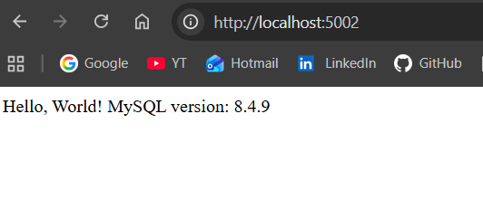
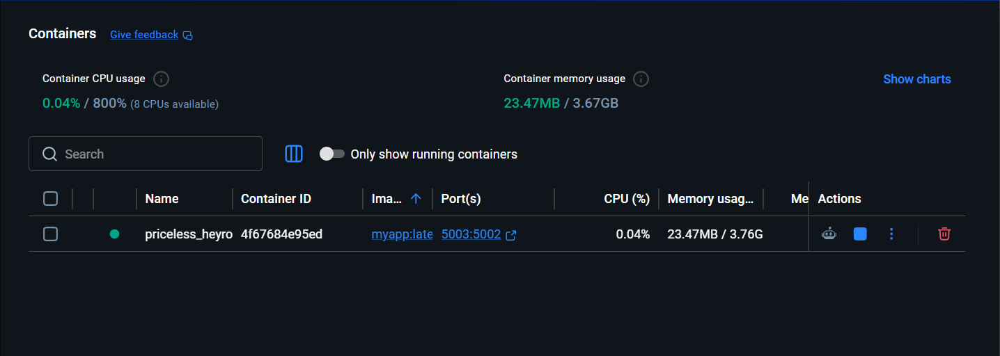
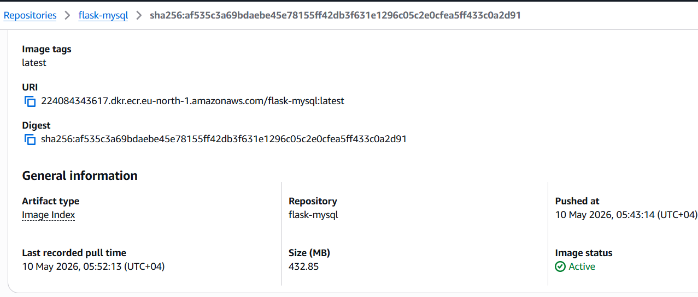

# Flask MySQL Docker App

A containerized Flask application connected to MySQL using Docker Compose.  
The application displays the MySQL server version from inside the containerized database.

---

## Architecture

```text
Browser → Flask App → MySQL Database
            │
            └── Docker Container
```

---

## Project Structure

```text
flask-app/
├── app.py
├── Dockerfile
├── docker-compose.yml
├── .env
├── README.md
└── screenshots/
    ├── app-home.png
    ├── docker-containers.png
    └── ecr-image.png
```

---

## Technologies Used

- Python
- Flask
- MySQL
- Docker
- Docker Compose
- AWS ECR

---

## Flask Application

The Flask app connects to MySQL using environment variables.

### Features

- Connects to MySQL container
- Displays MySQL version
- Uses Docker networking
- Uses persistent MySQL storage
- Health checks for service readiness

---

## Environment Variables

Create a `.env` file:

```env
MYSQL_HOST=mydb
MYSQL_USER=root
MYSQL_PASSWORD=my-secret-pw
MYSQL_DATABASE=mysql
```

---

## Docker Compose Configuration

### Services

| Service | Description | Port |
|---|---|---|
| web | Flask application | 5002 |
| mydb | MySQL database | 3306 |

---

## Persistent Storage

MySQL data is stored using a Docker volume:

```yaml
volumes:
  mysql_data:
```

This ensures database data survives container restarts.

---

## Health Check

Docker waits until MySQL is healthy before starting Flask.

```yaml
depends_on:
  mydb:
    condition: service_healthy
```

---

## Multi-Stage Docker Build

The Dockerfile uses a multi-stage build:

### Builder Stage
- Installs dependencies
- Builds Python packages

### Production Stage
- Copies only required files
- Smaller final image
- More secure and optimized

---

## AWS ECR Lifecycle Policy

The project includes an ECR lifecycle policy to:

- Delete untagged images older than 1 day
- Keep only the latest 5 images

Example:

```json
{
  "rules": [
    {
      "rulePriority": 1,
      "description": "Delete untagged images older than 1 day"
    },
    {
      "rulePriority": 2,
      "description": "Keep only last 5 images"
    }
  ]
}
```

---

# Getting Started

## 1. Clone Repository

```bash
git clone <your-repository-url>
cd flask-app
```

---

## 2. Build Containers

```bash
docker-compose build
```

---

## 3. Start Application

```bash
docker-compose up
```

Run in detached mode:

```bash
docker-compose up -d
```

---

## 4. View Running Containers

```bash
docker ps
```

---

## 5. Access Application

Open in browser:

```text
http://localhost:5002
```

Expected output:

```text
Hello, World! MySQL version: 8.x.x
```

---

## Useful Docker Commands

### Stop Containers

```bash
docker-compose down
```

### Restart Containers

```bash
docker-compose restart
```

### View Logs

```bash
docker-compose logs
```

### View Flask Logs

```bash
docker-compose logs web
```

### View MySQL Logs

```bash
docker-compose logs mydb
```

### Rebuild Containers

```bash
docker-compose up --build
```

---

## Docker Cleanup Commands

### Remove Unused Containers

```bash
docker container prune
```

### Remove Unused Images

```bash
docker image prune
```

### Remove Everything Unused

```bash
docker system prune -a
```

---

## Check Docker Disk Usage

```bash
docker system df
```

Verbose view:

```bash
docker system df -v
```

---

## MySQL Container Access

Enter MySQL container:

```bash
docker exec -it <container_name> bash
```

Login to MySQL:

```bash
mysql -u root -p
```

---

## Screenshots

### Flask Application


### Running Containers


### AWS ECR Image

### AWS ECR Image

```markdown

```

---

## Example Output

```text
Hello, World! MySQL version: 8.0.x
```

---

## Future Improvements

- Add Nginx reverse proxy
- Add CI/CD pipeline
- Deploy to AWS ECS
- Add Terraform infrastructure
- Add GitHub Actions
- Add Kubernetes deployment

---

## Author

Built as a DevOps portfolio project using Flask, Docker, MySQL, and AWS ECR.