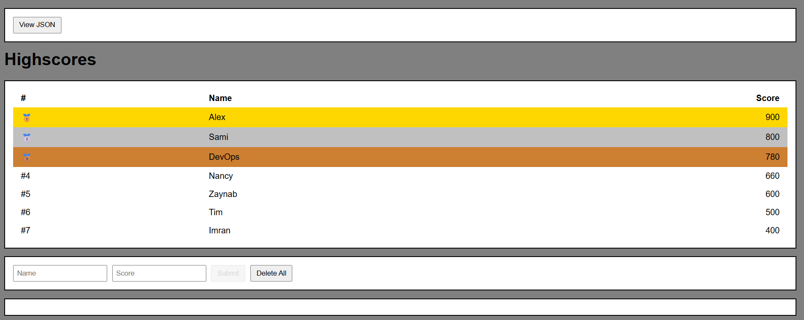
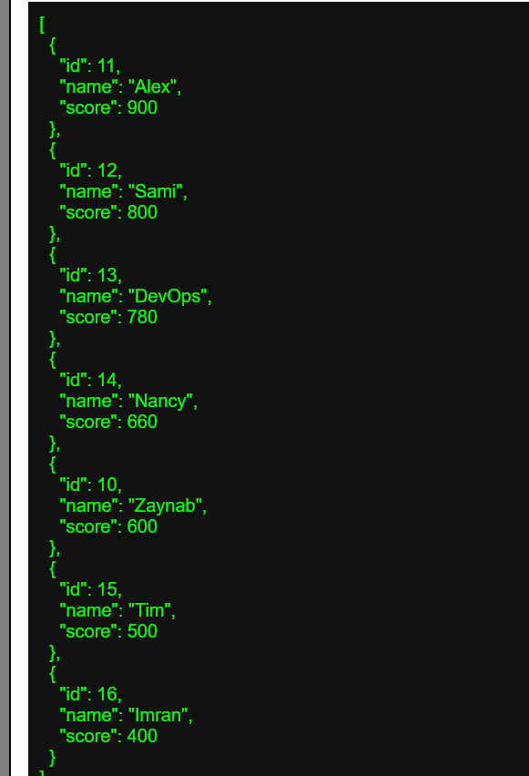
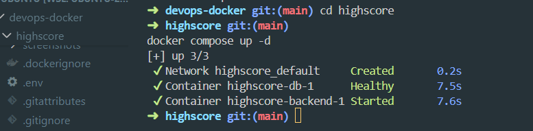
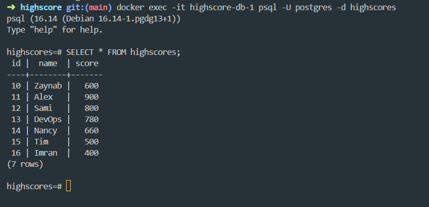
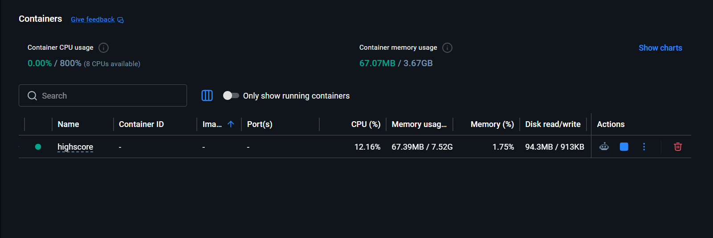

#  Highscore DevOps Project (Docker + PostgreSQL)

This project is a fully containerized backend application built with Node.js, Express, PostgreSQL, and Docker. It started as a simple in-memory highscore API and was later upgraded into a production-style DevOps project with database persistence, Docker Compose, and cloud-ready architecture. The main goal is to demonstrate real-world DevOps practices such as containerization, persistent storage, REST API design, debugging workflows, and deployment readiness.

# Architecture
```
Frontend (HTML)
↓
Node.js + Express API
↓
PostgreSQL Database (Docker Container)
↓
Docker Volume (Persistent Storage)
```
# Features
```
- REST API for highscores
- Persistent PostgreSQL database
- Docker containerized backend
- Docker Compose multi-service setup
- Health check endpoint
- Top 10 leaderboard system
```
# API Endpoints
```
GET / → Serves frontend UI  
GET /highscores → Get top 10 scores  
POST /highscore → Add new score  
DELETE /highscores → Clear all scores  
GET /health → Health check  
```

# Example Database Output

```sql
highscores=# SELECT * FROM highscores;
 id |  name  | score
----+--------+-------
 10 | Zaynab |   600
 11 | Alex   |   900
 12 | Sami   |   800
 13 | DevOps |   780
 14 | Nancy  |   660
 15 | Tim    |   500
 16 | Imran  |   400
(7 rows)
```

# Database Schema (PostgreSQL)
```
CREATE TABLE highscores (
  id SERIAL PRIMARY KEY,
  name VARCHAR(100) NOT NULL,
  score INT NOT NULL
);
```
# Docker Setup
Run project:
```
docker compose up --build
```
Services:
```
backend (Node.js + Express)
db (PostgreSQL)
postgres_data (Docker volume for persistence)
```
# DockerHub (Optional)
```
docker build -t highscore-app .
docker tag highscore-app your-dockerhub/highscore-app
docker push your-dockerhub/highscore-app
```
# DevOps Workflow
```
GitHub → Docker Build → DockerHub → EC2 / Local Deployment
```
# Screenshots

##  Highscore UI


##  JSON API Response


## Docker Containers


## PostgreSQL Database


## DockerHub Image


# Useful Commands (DevOps + Debugging)

Docker containers:
```
docker ps
docker compose ps
```
PostgreSQL access:
```
docker exec -it highscore-db-1 psql -U postgres -d highscores
SELECT * FROM highscores;
```
Volumes:
```
docker volume ls
docker volume inspect postgres_data
```

API testing:
```
curl http://localhost:3000/highscores
curl -X POST http://localhost:3000/highscore -H "Content-Type: application/json" -d '{"name":"Test","score":100}'
curl http://localhost:3000/health
```
Reset system:
```
docker compose down
docker compose up --build
docker compose down -v
```
